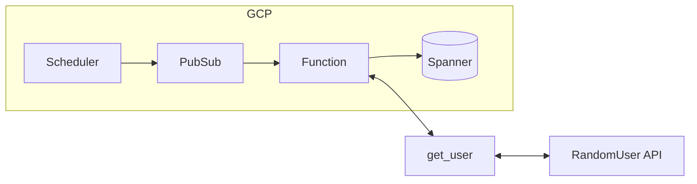

## Small function to load random user data into a Cloud Spanner Database



## IAM

Get GCP Project ID from gcloud config

```shell
PROJECT_ID=$(gcloud config list --format='value(core.project)')
```

Create service account

```shell
gcloud iam service-accounts create spanner-service \
    --display-name="Spanner Service" \
    --description="Service account for Spanner"
```

Bind service account to Spanner Instance

```shell
gcloud spanner instances add-iam-policy-binding changestream-test-instance \
    --member="serviceAccount:spanner-service@$PROJECT_ID.iam.gserviceaccount.com" \
    --role='roles/spanner.databaseUser'
```

Generate authentication key for service account

```shell
gcloud iam service-accounts keys create "spanner_service_key.json" \
    --iam-account="spanner-service@$PROJECT_ID.iam.gserviceaccount.com"
```

## Cloud Scheduler

Send message to PubSub topic

```shell
gcloud scheduler jobs create pubsub spanner-insert-random-user-trigger \
    --location=us-central1 \
    --topic=spanner-insert-random-user \
    --schedule='* * * * *' \
    --message-body='new-user'
```

## PubSub

Create topic

```shell
gcloud pubsub topics create spanner-insert-random-user
```

## Cloud Functions

Deploy function from Google Source Repository (mirroring GitHub)

```shell
gcloud functions deploy spanner-new-customer \
--region=us-central1 \
--runtime=python39 \
--trigger-topic=spanner-insert-random-user \
--source=https://source.developers.google.com/projects/$PROJECT_ID/repos/github_mogranjm_spanner-data-factory/moveable-aliases/main/paths/ \
--entry-point=insert_random_user \
--service-account=spanner-service@$PROJECT_ID.iam.gserviceaccount.com \
--set-env-vars=SPANNER_INSTANCE=changestream-test-instance,SPANNER_DATABASE=changestream-to-bq
```

# Pause/Resume

Stop/Start the Cloud Scheduler function trigger

```shell
gcloud scheduler jobs pause spanner-insert-random-user-trigger
```

```shell
gcloud scheduler jobs resume spanner-insert-random-user-trigger
```
